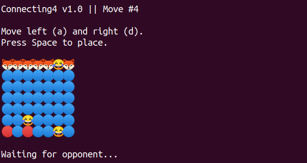

# asm-connect4

Connect4-style terminal game for two players written in 32-bit x86 assembly (NASM).



## Usage

Invite someone on the same server (will `write` them with an invitation) with:

```
./Connecting4 invite username
```

The invitee (who always gets first move) can accept with:

```
./Connecting4 join
```

> This code was written as a final project for Andrew's CSC-314 assembly class.

